# Minecraft Pyramid

Updated: Feb 27, 2019

Table of Contents

* The View
* Crops
* Cactus XP Farm

The running gag with any serious Minecraft player is that they have 17+ projects being worked on simultaneously.

Well, I can finally scratch _one_ off my Minecraft Bucket List:

* [x] Build a Big-Ass Pyramid

This project also has a few other names:

* _"Engineering R Us"_ a.k.a.
* _"This can't be good for my carpal tunnel."_

This normal looking pyramid by day ...

* 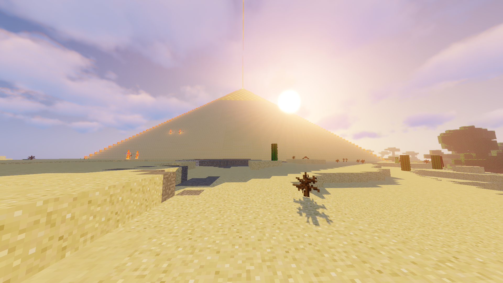

... has a secret lurking by night:

* 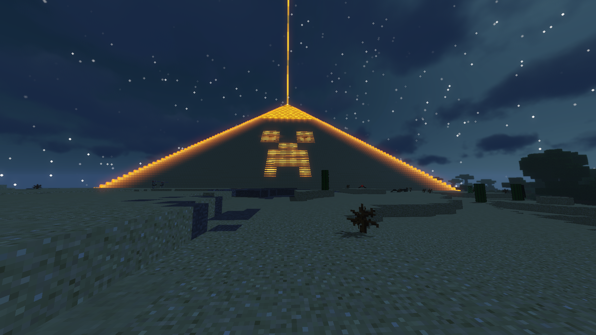

I designed and wired up the two circuits which took about an hour each.

All joking aside it is located in our desert mining operation. Here is the view from night when you first enter through the portal.

* 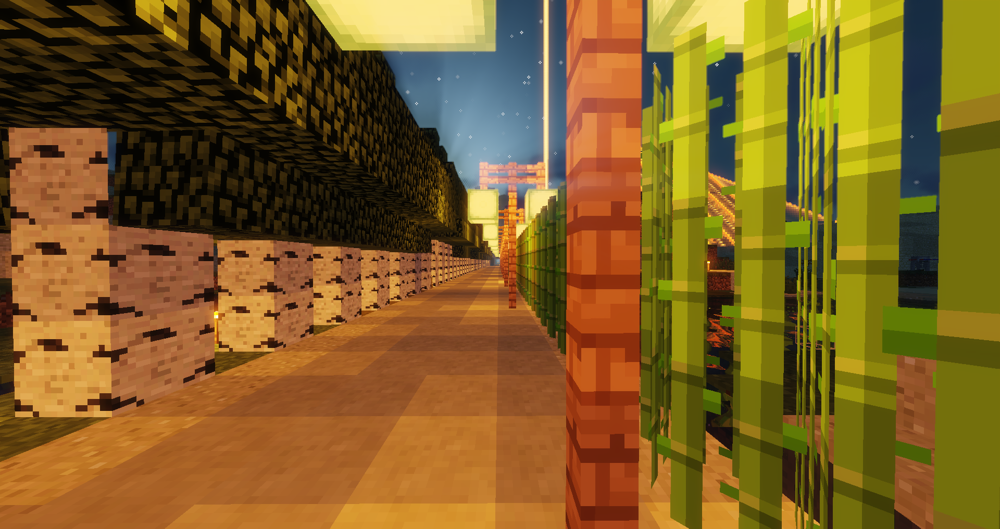

The pyramid is off to the right in the distance:

* 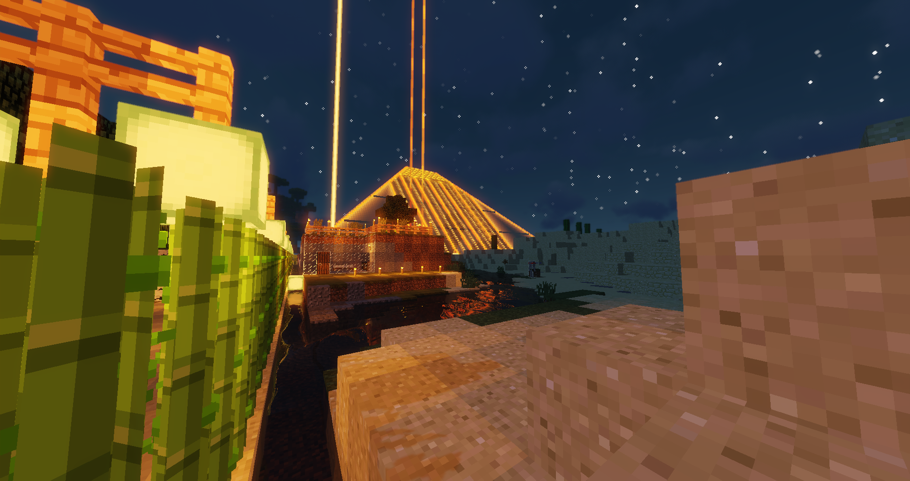

Moving along the path here is the view from the SE corner looking east from the portal entrace and north towards the east entrance:

* 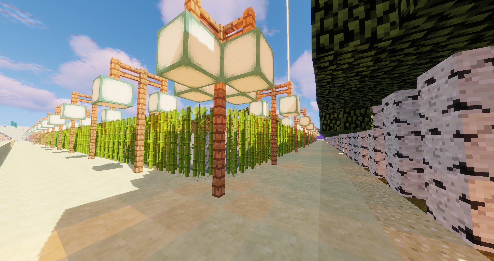

When we get to the East entrance here is the view at night looking south:

* 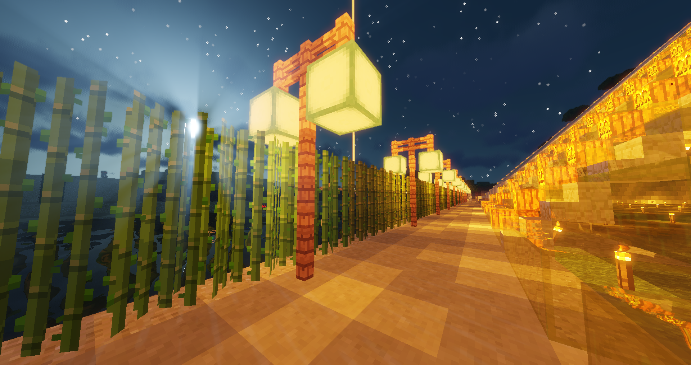

And looking up the East facing side with the "glowing" stairs.  I used "back-lighting" by placing torches on the inside which makes them "glow" at night.

* 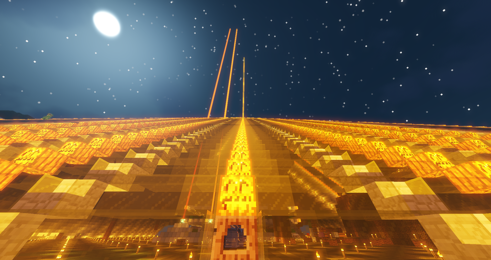

Inside the pyramid facing East here is what the main entrance looks like. NOTE: I'm using Optifine + a custom shader which tints all light sources yellow (you can change the tint.)

* 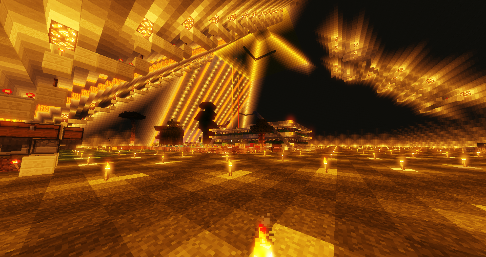

One of the problems with any "big build" is lighting. Initially I wasn't going to have any glass blocks but
after realizing that the ceiling blocks all the light and having torches on the ground just wasn't going to cut it.
I decided to rip most of the East facing side and replace it with glass, stairs, and Jack O' Lanterns.

Originally I resisted not due to having enough yellow dye but after making a quick "dye farm" that literally spits out hundreds of red, orange, yellow or magenta dye a minute (!!) using a "burn-out" redstone torch clock I went ahead.  (The burnout clock are 5x3 blocks placed in a circle shape with redstone torches placed every other block.)
In the future I probably will use more glass given how plentiful sand is -- Go figure when you are in the middle of a desert. =P

Here is the morning view looking out the East side.

* 

In hindsight I probably should of built more out of glass considering I'm in the middle of the desert with tons of sand I can smelt into glass.

I mentioned two circuits:

* The first circuit on a night sensor that turns on the Creeper lighting on the West side.
* The second circuit is also on a night sensor but on the North side.  The stairs are on a delayed timing circuit that
makes the turn on in increments as they slowly turn on going up the pyramid -- the goal was kind of like "landing lights".  I haven't seen any UFO's yet though. =P

* 

The view from the top shows our 64 furnace "super smelter" off in the distance beyond East past the main portal entrance. It is an original design by zmrazit. A double chest feeds 32 furnaces on the north and 32 furnaces on the south. It uses the 1.13 kelp blocks as fuel since they last just as long as charcoal.  Smelting a double chest uses ~3 kelp block per furnace.

* 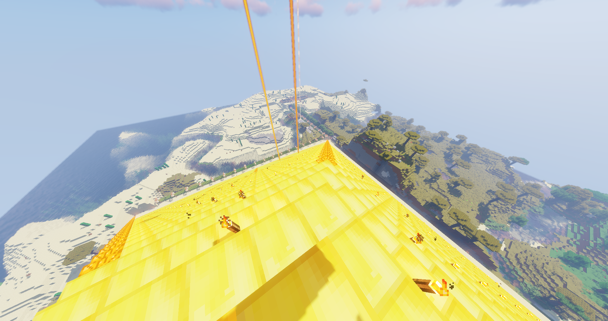

As you can tell I "splurged" and made the pyramid cap entirely out of gold blocks.  When you are rich and there is nothing else to spend them on so why not?

This 153 x 153 x 77 tall pyramid took about a week to build.  All 23,409 blocks were hand placed.

It's kind of funny to see Phantoms spawn inside. =P

Here the north facing side is done before I decided what to do with the air gap.

* 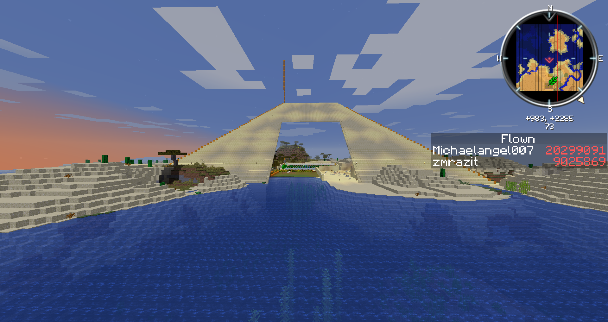

This shot is from the SE corner.

* 

I decided to go with a yellow glass theme.

* 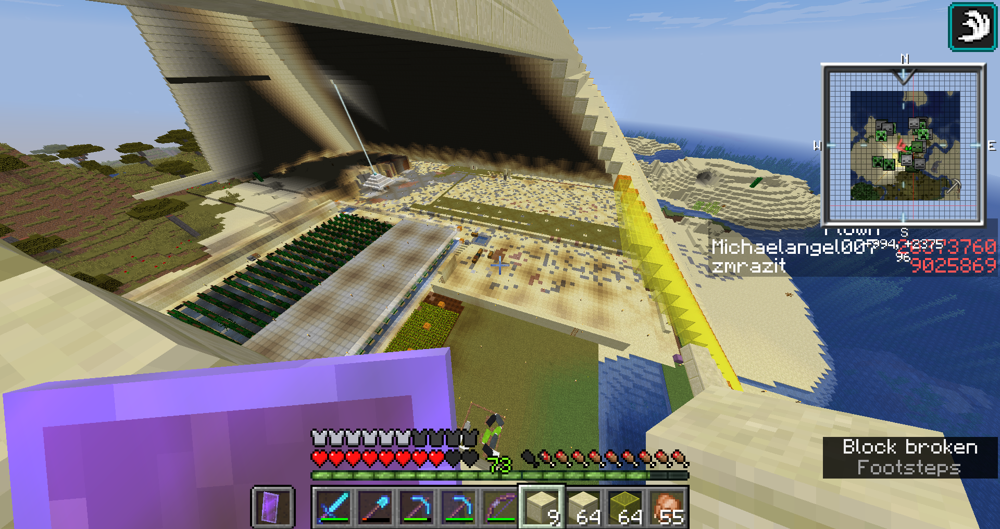

# Crops

Inside, the South West corner holds mini farms of beets, carrots, netherwart, potatoes, and wheat. Press a button and water naturally flows down the terraces to harvest the crops funneling
them into a center collection water channel.

* [ ] TOOD: Picture of farms

Using the new 1.13 water mechanics items now float to the surface so there is a 
water bubble column to bring items up into chests.

* [ ] TODO: Picture of watter

Currently everything is being dumped into a bunch of double chests.
Eventually I'll add an item sorter.

* [ ] TODO: Picture of item sorter

The only way to automate _replanting_ of crops is to trap villagers with the crop.
I wanted to minimize lag since I already have a cactus XP farm (furnaces with carpet duper)
so I decided to pass on the villager virtual slave labor this time.

# Cactus XP Farm

The center of the pyramid features a multi-level cactus farm + cactus XP farm.

* [ ] TODO: Picutre of cactus farm

Each floor has 20 x 20 = 400 cactus.

Ilmango showed a very compact Minecraft 1.13 version "zero tick" cactus XP farm:

* [[24/7] Fully Automatic XP Farm 1.13.1+](https://www.youtube.com/watch?v=TEVrdTVflJk).

That is, it automates cactus growing by "shifting"  the sand underneath the cactus
in order to force trigger an update which causes the cactus to grow extremely fast.
It has numerous advantages ...

* Super compact
* Lag friendly; uses water streams to pull cactus and carpet into the furnaces
* Uses a carpet duper for infinite fuel

but one *major* disadvante:

* It is EXTREMELY noisy due to all the pistons firing moving the sand!

Given the choice between sounds of ...

* trickling/running water, or
* pistons _constantly_ firing

... I decided to go with the much larger water-based Minecraft 1.12 version.

Underneath is a water collection system that flushes the cactus into furnaces.

There is a master switch that duplicates carpet which is pulled into the furnaces
there they are used a fuel. There is an automatic safety over-ride switch
that turns the carpet duper off.  (Chest at the end of the fuel line
with an comparator that sends a redstone signal back to the on/off switch.)

The cactus are smelted into green dye and then using an observer clock are 
dumped into a cactus where the dye is automatically destroyed.

To repair your items there is a level in front of each furnace where you can
"lock" the furnace. Then when the next cactus that is smelted the dye will stay
in the hopper.  When you manually remove it you will get a TON of XP due
to the furnace storing the XP from ALL the previously smelted cactus.

Now to finish those 10 floors of the Cactus XP farm inside ... :-)
